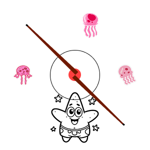

# Bar do Patrick

Trabalho para a disciplina de Algoritmos e Estrutura de Dados I com a biblioteca graphics.py

<p align="center">
  
</p>

## Jogo de Sinuca – Regras e Controles

### Forma de jogar:

O objetivo do jogo é encaçapar as bolas coloridas ou numeradas com a bola branca. A partida segue a regra de que o jogador deve encaçapar todas as bolas de sua categoria (maiores ou menores) e, por último, encaçapar a bola 8 para vencer.

### Controles:

* **Mira e Direção:** Clique com o mouse para alinhar o taco à bola branca. O "aim assist" ajuda a ajustar a trajetória da tacada.

* **Força:** Quanto mais distante você clicar da bola branca, mais forte será a tacada.

* **Tacada:** Pressione "Enter" para executar a tacada com a força determinada pela distância do clique.

```bash
# Dentro do diretório root
python3 sinuca.py
```
